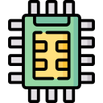

  
  <h1>Emb Division-by-2 algorithm in STM32</h1>
   

## About

The project, as a result of interest and university practice in embedded systems. The project has no purpose, but it can be used as an abstract tutorial on dividing a number by two.

## Components

* Microcontroller: STM32F411CE
* Led & Display: TM1638 (x2)
* Matrix Keypad: 5x4

## Contributors ✨

<!-- ALL-CONTRIBUTORS-LIST:START -->
<!-- markdownlint-disable -->
<table>
  <tbody>
    <tr>
      <td align="center" valign="top" width="14.28%"><a href="https://github.com/quesoon"> <b>SEMUL</b></a> <a href="https://github.com/quesoon/emb/commits?author=quesoon" title="Code">💻</a></td>
    </tr>
  </tbody>
</table>

<!-- markdownlint-restore -->
<!-- ALL-CONTRIBUTORS-LIST:END -->